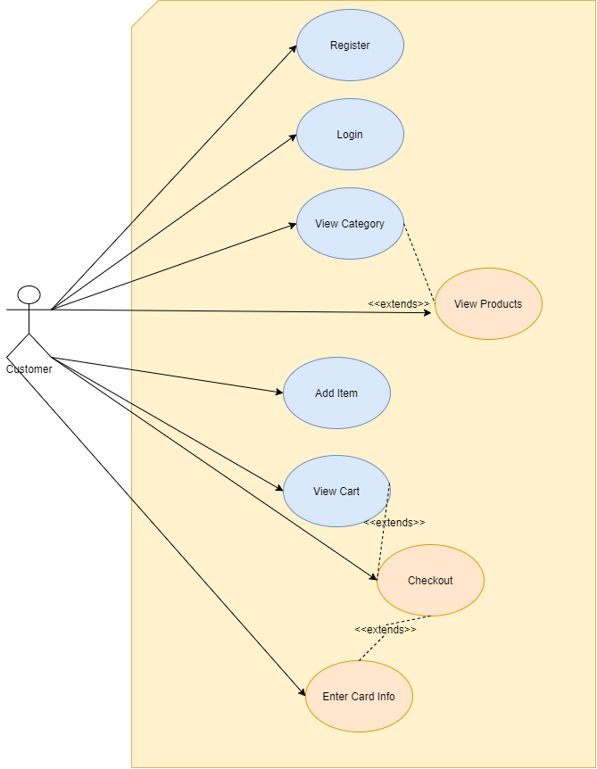
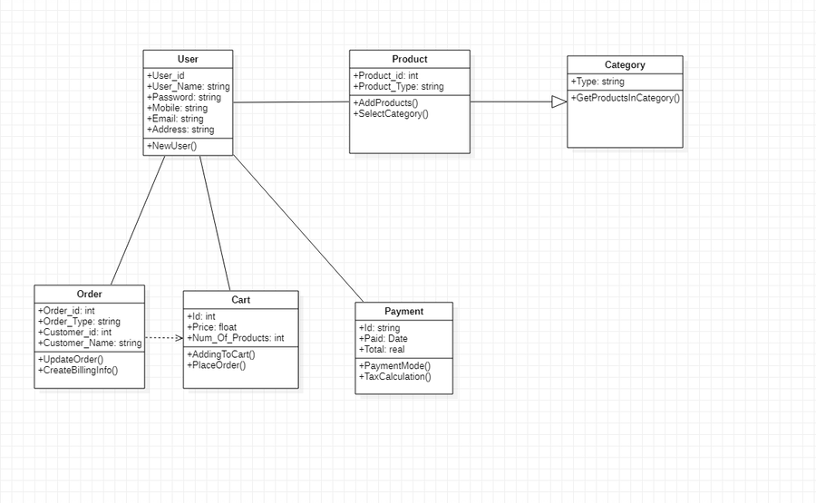

# DemoKart

# High Level Requirements:
(.vs/DemoKart/v16/lld_cd.PNG)

  1. Use Case Diagram will only have one actor i.e. Customer/User as
  2. User can login using username and password if he/she is registered or register if it is a first time login.
  3. User can browse various products based on categories.
  4. User can add/edit item in cart.
  5. After shopping is done, user can checkout and provide what kind of payment he/she wants.

# Low Level Requirements:

  1.Product: It list the available products and attributes are Product_id, Product_type
  2.User: Performs operations like add product to the cart, Placing Order, Bill payment and attributes are User_id, User_Name, Password, Mobile, Email, Address.
  3.Order: specifies the quantity of the product and attributes are Order_id, Order_Type, Customer_id, Customer_Name.
  4.Payment:  it can be made in the form of cash and card and attributes are id, Price, Num_of_products.
  5.Cart: Contains the products which the user added to it and attributes are id,price,total.
  6.Category:  lists type of products and attributes are Type of product.

# SWOT Analysis:
## Strength
1. Saves time by reducing physical movement.
2. Variety of products available with help of some clicks.
3. Application is available 24x7 so no time constraints.

## Weakness
1. Customer might feel insecure about payment methods as it is not encrypted yet.
2. As a new venture delievery might take more time.
3. Availability of prodcuts might differ as compared to big giants like Amamzon.
4. Quality of prodcuts can't be determined as it can't be touched.

## Opportunity
1. Introduction of customer support maybe using live chat.
2. Our platform will be open for promotion and promoting others like a collaboration.
3. Using big data we can undertsand our customer's preference.

## Threat
1. Since no solid security framework is in place, it might face some security issues.
2. Doesn't have a dedictaed app for phones so might feel a bit tedious to use it on the browser.

